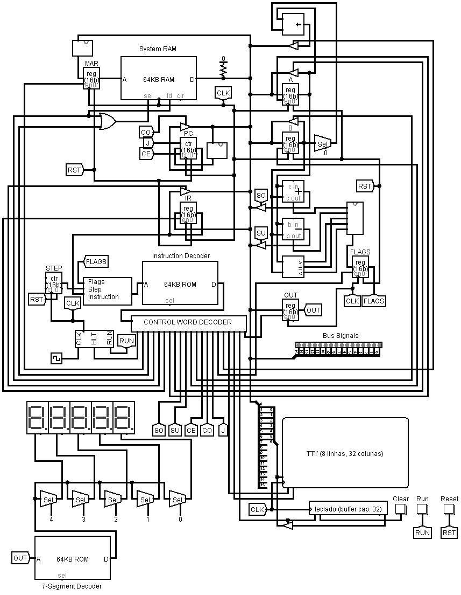

LogisimComputer
==================

16-bit fully programmable computer built in Logisim.

Software
------------

- `compiler.py` for expandable instruction set
- Grammar supporting labels, conditional jumps, constants and comments
- Script `create_rom_file.py` for converting the instruction set spreadsheet
  into hex ROM values

Hardware
------------

- Control Unit: Instruction register and decoder, program and step counter, clock
- ALU: Adder, subtractor, bit-shifter, comparator and flags register
- I/O: 7-segment displays controlled by output register; simple TTY and keyboard
- 2 General Purpose Registers
- RAM, 512 bytes adress space

Sample Programs
------------

- Turing Machine: simulate a TM that adds 1 to a binary number input via keyboard
- Fibonacci: Generates the Fibonacci sequence, printing each number on the 7-segment displays

References
------------
- Based on Ben Eater's [breadboard computer guide](https://eater.net/8bit)